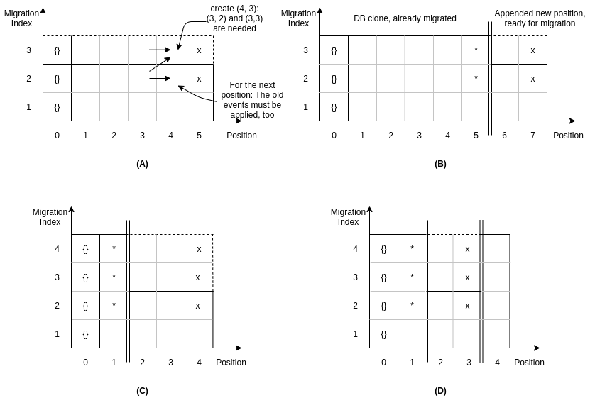

# Concept

Remember, that the datastore stores many events per position. The versioning is done by assigning each position a `migration index` (MI). Every event within this position has the same migration index. In normal operation, all position have the same migration index, starting at 1. A migration increments the migration index, so applying the first migration to a position, it has the migration index 2 afterwards.

A migration itself is just a function converting each event to a possible new event. It is also possible to completely change the event, or return a different number of events than one. During this conversion, the migration has access to the content of the Datastore before the position to migrate in two fashions: The old (unmigrated) data and the new (migrated) data. Also the information about the position is provided.

This is enclosed in the `BaseMigration` class. One method must be implemented by each migration:

```py
def migrate_event(
    self,
    event: BaseEvent,
    old_accessor: MigrationKeyframeAccessor,
    new_accessor: MigrationKeyframeAccessor,
    position_data: PositionData,
) -> Optional[List[BaseEvent]]:
```

If `None` is returned, this migration does not change anything on this position. This is the same as returning `[event]`, which also is a noop-migration. Note, that it is allowed to modify the provided event as well as creating new ones.

Migrations can be visualized as in the following figure:



Lets focus on figure (A): The migration index is visualized for each position. Note that position 0 does not explicitly exists and is marked with `{}` to indicate an empty datastore. In this figure the process of migrating all positions from MI 2 to MI 3 is visualized. MI 2 is called the `source migration index` and MI3 the `target migration index`. This is the second migration since an earlier migration must have changed the MI from 1 (initial) to MI 2. To migrate one position, the previous position must already be migrated. The first position to migrate in this example is position 1 using the data from the previous position, which is position 0, the empty datastore.

First, all old events of the position are converted to new events using the data of the previous position with the old and new migration indices. These datasets are called `migration keyframes` and hold the complete datastore content at the given position and migration index. After conversion, the new events are applied to the the migration keyframe with the target MI. The old events are applied to the migration keyframe with the source MI. Both keyframes are then moved one position further to be used by the next position. This process is iterated until all positions are migrated to the target MI. This process is visualized for creating the new events for position 4.

At the last position the `x`-es in the figure visualize all existing keyframes after the migration. After this basic migrations steps, the migration must be finalized. This includes removing all keyframes and recalculating auxillary helper tables used by the datastore.

# Cascade migrations
In the case of many events that take some time to migrate, a cascade migration can be executed.

The migration is split into two phases:
- `migrate`: Migrate all events of all unmigrated positions into a second, temporary table. This does not affect the live usage of the datastore and can be done in parallel.
- `finalize`: Does a `migrate` first to ensure, that all positions are migrated. Then, the keyframes are deleted and the helper tables are re-calculated. Lastly, the temporary table becomes the main table to use in production. This step needs the full access to the datastore and can only be executed when the Datastore itself is offline.

The phases can directly be recognized by the steps to apply, from an operator's perspective:

1) Spin up a new container with the new migration code. Execute `python migrate.py migrate`. This migrates all existing positions into a temporary data structure.
3) Take OpenSlides offline and prepare all new images.
4) Spin up the migration container again and execute `python migrate.py finalize`. This migrates all left-over positions and moves the temporary data structure to the productive one. Also helper-tables are adapted to the new migration data and keyframes are deleted.
4) Start OpenSlides with the new version.

### How does it work:

Figure (B) visualizes the basic cascade migration: The double-line after position 5 marks the point in time, where the first `migrate` ends. These events are only in the temporary table. All positions up to 5 are already migrated from MI 2 to MI 3. There are two keyframes (5,2) and (5,3) saved in the database. To finalize, `migrate` is run again to migrate the unmigrated positions 6 and 7, which are also written to the temporary table. The keyframes marked with `x`-es are left ofer after the migrations. these are deleted, the helper tables re-calculated and the temporary table with all new events becomes the productive one. After this, the Datastore is fully migrated and can be used again.

Figure (C) shows the same workflow, but with two migrations at the same time, so there are three keyframes involved. The migration order is _migration-index-first_, position second: First, (2,3) is migrated, than (2,4) and after the first position with a non-target migration index is fully migrated, the next position is done.

To let the datastore operate, all positions must have the same migration index, so it must be fully migrated. This is be lazy-checked on the first writerequest. If there exists a position with a migration index different to the maximum migration index, a InvalidDatastoreState exception will be returned. Also during migrations, the migration index cannot raise. E.g. the situation in figure (D) is prohibited since position 4 has a higher MI as the previous position.

# Notes

## Tables `collectionfields` and `events_to_collectionfields`
Those tables are cleared before the migration. Since the datastore is stopped during migration, there is must be no locking during the offline time. With those tables cleared, locking for a fqfield or collectionfield will not work, but this is ok: When starting the Datastore, the first request must succeed (in terms of locking) since nothing else has written before it. When there are two concurrent requests, the second one can still be locked by the first one since with the first request writing the new events, the two tables will also be updated.
